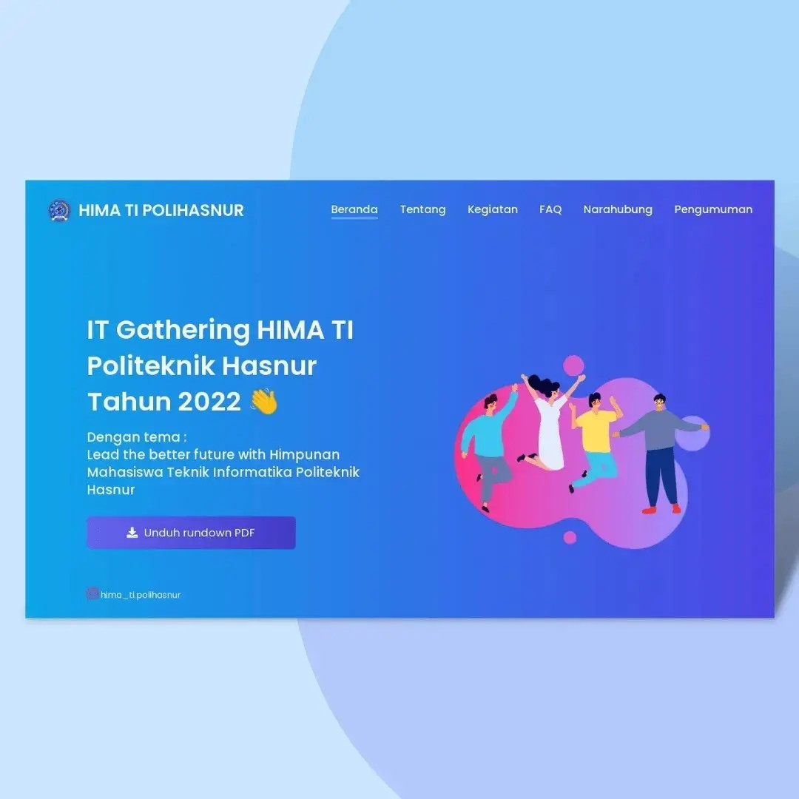
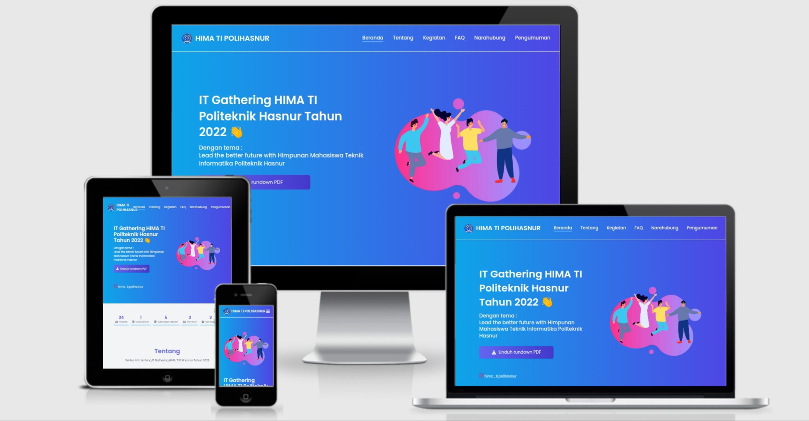

<h3 align="center">Landing Page</h3>

IT Gathering HIMA TI Politeknik Hasnur Tahun 2022 - Build using Vue JS and Tailwind

## About
The landing page for the "IT Gathering HIMA TI Polihasnur in 2022" is the official website that contains introductory information about this activity as well as being an information center during the activity. 
 
This website was built to make it easier for participants to recognize and find information about this activity and to make it easier to disseminate information to participants

## Responsive Test

## Languages and Tools
- Vue JS 3
- Tailwindcss
- Font Awesome 5
- Google Fonts Poppins
- Freepik
- Vite JS
- Git 
- Github
- Vercell
- Termux
- Micro Text Editor

### How to install
- <code>git clone https://github.com/or-abdillh/landing-page.git </code>
- <code>cd landing-page</code>
- <code>npm install</code>
- <code>npm run dev</code>

### Demo 
- [Landing Page](https://it-gathering.vercel.app/)
- [Instagram](https://www.instagram.com/p/CZwzrLTPA1e/?utm_medium=copy_link)

### Thanks 
- Support me with a cup of coffee and other snacks [here ..](https://saweria.co/orabdillh)
- Don't forget to give me star in this repository 🙏🏻🙏🏻
- See my other projects on instagram [@or.abdillh](http://www.instagram.com/or.abdillh)

[Oka R Abdillah ](http://github.com/or-abdillh)
 
Last edited on : 11/02/2022
